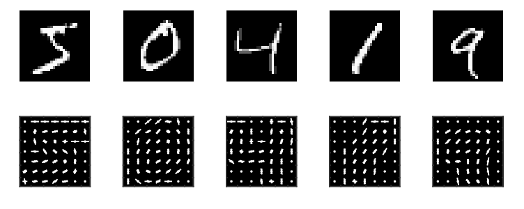
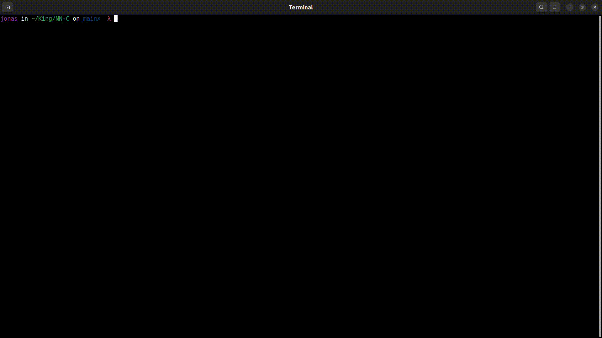

# Red Neuronal en C

**Implementación de una red neuronal (perceptron) en C para reconocer el digito escrito a mano usando el dataset MNIST**. El perceptrón es una red neuronal artificial de una sola capa que se utiliza para la clasificación binaria supervisada. El perceptrón usa una matriz para representar las redes neuronales y es un discriminador terciario que traza su entrada (un vector binario) a un único valor de salida (un solo valor binario) a través de dicha matriz. El perceptrón simple es un modelo de clasificación que consiste en un hiperplano que separa el espacio en dos regiones y asigna una clase a cada una de ellas, 
en cuanto a la operación del producto punto, el perceptrón utiliza el producto punto para calcular la suma ponderada de las entradas y los pesos sinápticos



_Base de datos MNIST_


## Compilación

Primero debes entrenar la red neuronal con el dataset MNIST, para ello [descargala de kaggle](https://www.kaggle.com/datasets/oddrationale/mnist-in-csv?resource=download), descomprimela y guarda los mnist_train.csv y mnist_test.csv en la carpeta data del proyecto

Antes de ejecutar la predicción debes de entrenarlo con el dataset MNIST, para ello ejecuta asegurate de comentar en el programa main.c la parte de la predicción y descomenta la parte del entrenamiento, esta parte debe quedar de la siguiente manera:


### Entrenamiento

Para entrenar la red neuronal se debe ejecutar el siguiente comando:

```bash
make
```



_Entrenamiento de la red neuronal_

```c
//ENTRENAMIENTO
int number_imgs = 10000;
Img** imgs = csv_to_imgs("data/mnist_train.csv", number_imgs);
NeuralNetwork* net = network_create(784, 300, 10, 0.1);
network_train_batch_imgs(net, imgs, number_imgs);
network_save(net, "testeo_neuronal");
```

### Predicción

Una vez terminado el entrenamiento puedes ejecutar la predicción, para ello debes de comentar la parte del entrenamiento y descomentar la parte de la predicción, esta parte debe quedar de la siguiente manera:

```c
// PREDICCIÓN
int number_imgs = 3000;
Img** imgs = csv_to_imgs("data/mnist_train.csv", number_imgs);
NeuralNetwork* net = network_load("testeo_neuronal");
double score = network_predict_imgs(net, imgs, 1000);
printf("Score: %1.5f \n", score);
```

Para ejecutar el programa se debe ejecutar el siguiente comando:

```bash
make
```


_Predicción de la red neuronal_

## Expresiones de gratitud

_Escrito con ❤️ por [Jonas Lara](https://medium.com/@jonas_lara) estudiante de ingeniería en IA en la [UPIIT](https://www.upiit.ipn.mx/) para quien sea que este interesado_


